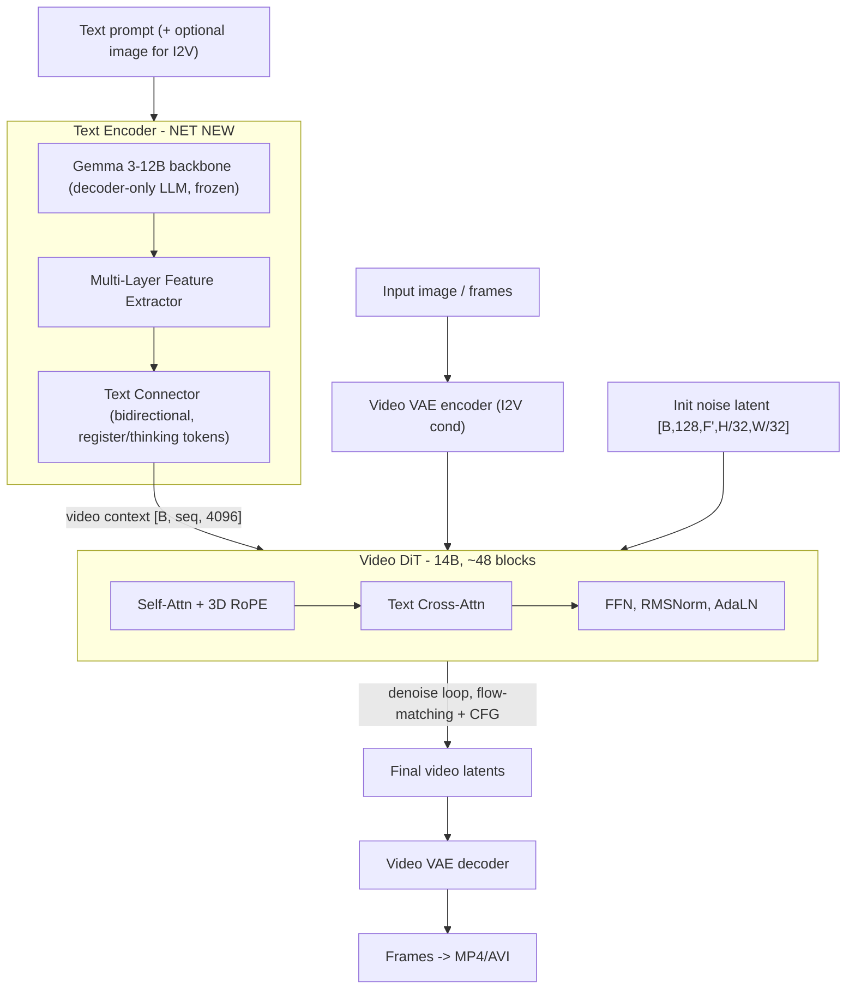

# LTX-2 Support — Feasibility & Research Findings

Status: research pass (Step 1). No code plan yet. This document captures what LTX-2
actually is, what this repo already provides, and the open
decisions/risks that must be resolved before a concrete implementation plan.

---

## 1. What LTX-2 actually is

LTX-2 is Lightricks' open-weights **audio-video** DiT foundation model (released
2026-01-06, arXiv:2601.03233). It is **not** the same as the older `LTX-Video` model
(arXiv:2501.00103) for which this repo has a 73-line stub at
[src/ltxv.hpp](src/ltxv.hpp) (only a `CausalConv3d` block, wired into nothing).

Two HuggingFace repos exist:

- `Lightricks/LTX-2` — the **19B** model = **14B video stream + 5B audio stream**.
  - `ltx-2-19b-dev.safetensors` (~43 GB bf16), `...-fp8` (~27 GB), `...-fp4` (~20 GB),
    `ltx-2-19b-distilled.safetensors` (8 steps, CFG=1), distilled LoRA, spatial/temporal upscalers.
- `Lightricks/LTX-2.3` — a newer **22B** variant: `ltx-2.3-22b-dev.safetensors`,
  `ltx-2.3-22b-distilled-1.1.safetensors`, `ltx-2.3-22b-distilled-lora-384-1.1.safetensors`.

Reference code:

- Official monorepo: `github.com/Lightricks/LTX-2` (`packages/ltx-core` has the model defs;
  `packages/ltx-pipelines` has T2V/I2V pipelines).
- Cleaner third-party PyTorch port: `deepbeepmeep/Wan2GP` `models/ltx2/ltx_core/...`
  (useful, more digestible reference for VAE/transformer porting).

### Scope per the grant

In scope: **video stream only** — T2V + I2V. Out of scope (explicitly): the 5B audio
stream, Audio-VAE, vocoder, spatial/temporal upscalers, video-to-video, training, GUI.

This matters: LTX-2 has a **video-only inference path** (`VideoGemmaTextEncoderModel` +
the transformer run without the audio stream / without A↔V cross-attention), so dropping
audio is supported by design — we do not need to implement the audio half.

---

## 2. In-scope components and architecture

### 2a. Video VAE (spatiotemporal causal)

- Compression **32×32×8** (spatial 32, temporal 8), **128 latent channels**, no patchifier
  in the transformer (1×1×1).
- Encoder: `[B,3,F,H,W] -> [B,128, 1+(F-1)/8, H/32, W/32]`; requires `(F-1) % 8 == 0`.
- Decoder: `[B,128,F,H,W] -> [B,3, 1+(F-1)*8, H*32, W*32]`.
- Uses causal 3D convs, `PixelNorm`/`GroupNorm`, SiLU, and per-channel latent
  mean/std statistics baked into the encoder (`per_channel_statistics.normalize`).
- Reuse signal: the repo already implements causal 3D VAE machinery for Wan
  (`WAN::CausalConv3d`, `WanVAE`, `WanVAERunner` in [src/wan.hpp](src/wan.hpp)) and the
  stub `LTXV::CausalConv3d` in [src/ltxv.hpp](src/ltxv.hpp). The op set (Conv3d, causal
  padding) is already present.

### 2b. Video DiT (14B)

- ~48 transformer blocks (shared depth with audio; video stream width is larger).
- Each block (video-only path): RMSNorm + **AdaLN** (timestep-conditioned) -> **Self-Attn
  with 3D RoPE** -> RMSNorm -> **Text Cross-Attn** -> RMSNorm + AdaLN -> **FFN**.
  (The A↔V cross-attention sublayer is the audio coupling and is skipped for video-only.)
- Reuse signal: this is structurally close to `WAN::Wan` /`WanAttentionBlock`
  (AdaLN modulation, self-attn + text cross-attn, 3D RoPE via `Rope::gen_wan_pe` in
  [src/rope.hpp](src/rope.hpp)). The DiffusionModel adapter pattern is `WanModel` in
  [src/diffusion_model.hpp](src/diffusion_model.hpp).

### 2c. Text encoder — Gemma 3-12B + Feature Extractor + Text Connector (BIGGEST NET-NEW PIECE)

- Backbone: **Gemma 3-12B** decoder-only LLM (frozen), multilingual.
  - The repo's LLM support (`src/llm.hpp`, `enum LLMArch { QWEN2_5_VL, QWEN3,
MISTRAL_SMALL_3_2 }`) does **not** include Gemma 3. This is net-new: Gemma 3 attention
    (sliding-window + global layers), RMSNorm, GeGLU MLP, and a SentencePiece/Gemma tokenizer.
- Multi-Layer Feature Extractor: aggregates **all** decoder layers `[B,T,D,L]`, mean-centered
  scaling, flatten to `[B,T,D×L]`, learnable projection `W` (trained with LTX-2).
- Text Connector: bidirectional transformer with learnable **register / "thinking" tokens**
  replacing padded positions; the video connector outputs **`[B, seq, 4096]`**.
- The Feature Extractor + Connector weights live in the LTX-2 checkpoint (not in Gemma).

### 2d. Scheduler / guidance

- LTX-2 uses flow-matching with `LTX2Scheduler` / `LinearQuadratic` timestep schedule and
  Euler updates; CFG (and optionally STG/APG, out of scope).
- Reuse signal: repo has `DiscreteFlowDenoiser` (`prediction_t::FLOW_PRED`) and ~14 sigma
  schedulers in [src/denoiser.hpp](src/denoiser.hpp), but **no LinearQuadratic schedule**.
  A new scheduler + the LTX timestep shift is net-new but small.

---

## 3. Mapping to existing repo infrastructure

Reusable as-is or with light adaptation (Wan video pipeline is the template):

- Video generation entrypoint `generate_video()`, `vid_gen` CLI mode, and the public C API
  `sd_vid_gen_params_t` / `generate_video()` in
  [include/stable-diffusion.h](include/stable-diffusion.h).
- Latent geometry helpers (`generate_init_latent`, `process_latent_in/out`,
  `get_vae_scale_factor`, `get_latent_channel`, frame alignment) in
  [src/stable-diffusion.cpp](src/stable-diffusion.cpp) — need LTX values (scale 32, 128 ch,
  `(F-1)%8` alignment).
- `GGMLBlock`/`GGMLRunner` framework, 3D RoPE, Conv3d, RMSNorm, AdaLN, attention ops in
  [src/ggml_extend.hpp](src/ggml_extend.hpp).
- GGUF conversion path: C++ `-M convert` -> `convert()` -> `save_to_gguf_file()`
  ([src/model.cpp](src/model.cpp)); tensor-name remap in
  [src/name_conversion.cpp](src/name_conversion.cpp).
- Model registration pattern: `enum SDVersion` + `sd_version_is_*` + detection in
  `ModelLoader::get_sd_version()` ([src/model.h](src/model.h),
  [src/model.cpp](src/model.cpp)).

Net-new (no existing equivalent):

1. **Gemma 3-12B encoder** + tokenizer (largest single piece).
2. **LTX Feature Extractor + Text Connector** (LTX-specific trained modules).
3. **LTX Video VAE** (new class; can borrow Wan/`LTXV` conv blocks).
4. **LTX DiT** (new class; structurally similar to `WAN::Wan`).
5. **LinearQuadratic / LTX2 scheduler**.
6. **Video-stream extraction + name conversion** from the combined 19B/22B checkpoint.
7. **CI workflows** (`.github/workflows/` does not exist today) and a **Python/C++ GGUF
   conversion** path for LTX (no model-conversion Python currently in the repo).
8. **MP4 output** — CLI currently writes **MJPEG-in-AVI** (`avi_writer.h`), not MP4; the
   grant asks for MP4 or raw frames (raw frames is the low-risk option).

---

## 4. Key risks / feasibility concerns

1. **Gemma 3-12B is a full 12B LLM used as the text encoder.** This is effectively a
   second model to implement from scratch (new arch in `llm.hpp` + tokenizer). It is the
   single largest risk to the timeline and is not optional — LTX-2 conditioning depends on
   the multi-layer Gemma features.
2. **Memory budget vs grant target.** Target is Q4 ≤ 12 GB RAM (CPU) / ≤ 10 GB VRAM (GPU),
   but 14B DiT (Q4 ≈ 7–8 GB) + Gemma 3-12B (Q4 ≈ 7 GB) + VAE cannot co-reside in 10 GB.
   Feasible only via **sequential component staging** (encode text -> free encoder ->
   load DiT -> free -> load VAE). The repo's `offload_params_to_cpu` + per-component
   loading supports this, but the target is tight and must be validated early.
3. **Checkpoint ambiguity (14B vs 19B vs 22B).** Need the exact target. The bf16 `dev`
   checkpoint (~43 GB) is the conversion source; `fp8`/`fp4` are NVIDIA-specific and not a
   usable GGUF source. Disk/bandwidth is significant.
4. **Quality metric methodology.** PSNR ≥ 25 dB / SSIM ≥ 0.85 vs PyTorch must compare the
   **same single-stage pipeline** at F16. The recommended LTX pipeline is **two-stage with a
   spatial upscaler** (out of scope), so the reference must be the single-stage
   base/distilled path, fixed seed, fixed scheduler/steps.
5. **dev vs distilled.** `distilled` (8 steps, CFG=1) best hits "2s clip in <5 min" and
   halves compute (no CFG). `dev` needs CFG (2× forward passes) + more steps. Recommend
   targeting distilled first for the success metrics, dev for the quality baseline.
6. **LTX-2.3 distilled needs a distilled-LoRA** for the standard pipeline -> may require
   LoRA fusion at convert time. Repo has LoRA support, but fusing into a video DiT is new.
7. **PR 2 (Bare addon) target repo is "TBD"** in the grant — blocked until the repo link
   exists; pattern is `bare-llama-cpp`.

---

## 5. Open decisions (need your input before the code plan)

1. **Target checkpoint:** `Lightricks/LTX-2` 19B (video stream = the "14B" in the grant)
   or `Lightricks/LTX-2.3` 22B? Recommendation: start with `LTX-2` 19B (matches the 14B
   figure, slightly smaller, has the cleaner Wan2GP reference port).
2. **dev vs distilled first:** Recommendation: bring up **distilled** first (fewer steps,
   CFG=1) to reach end-to-end video fastest, then add `dev` + CFG for the quality baseline.
3. **Output format:** raw frames + optional MJPEG-AVI (reuse existing writer) for M1–M2,
   and add real **MP4 (H.264)** later? Or is MJPEG-AVI acceptable for "MP4 or raw frames"?
4. **Gemma encoder strategy:** implement Gemma 3 natively in `llm.hpp`, or is reusing an
   external GGUF Gemma 3 encoder acceptable (still needs the LTX feature-extractor +
   connector on top)? This is the biggest scoping lever.
5. **Conversion tooling:** Python script (HF safetensors -> GGUF, like llama.cpp's
   `convert_hf_to_gguf.py`) vs extending the in-repo C++ `-M convert` path. Recommendation:
   a Python converter for the DiT/VAE/connector + reuse llama.cpp tooling for Gemma.

---

## 6. Conclusion

The bounty is feasible but large. The video DiT and Video VAE map well onto the existing
**Wan** video template, and the core ggml ops (Conv3d, 3D RoPE, AdaLN, flow-matching) already
exist. The dominant risk and effort is the **Gemma 3-12B text encoder + LTX feature
extractor/connector**, followed by the **memory budget** for running a 14B DiT + 12B encoder
on consumer hardware. Recommended first concrete step (M1): pin the checkpoint, build the
GGUF conversion + name map, add the `SDVersion`/detection scaffolding, and get the **Video
VAE decode** running on CPU (smallest self-contained, visually verifiable component) before
tackling the DiT and Gemma encoder.
